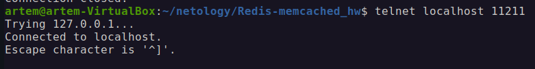
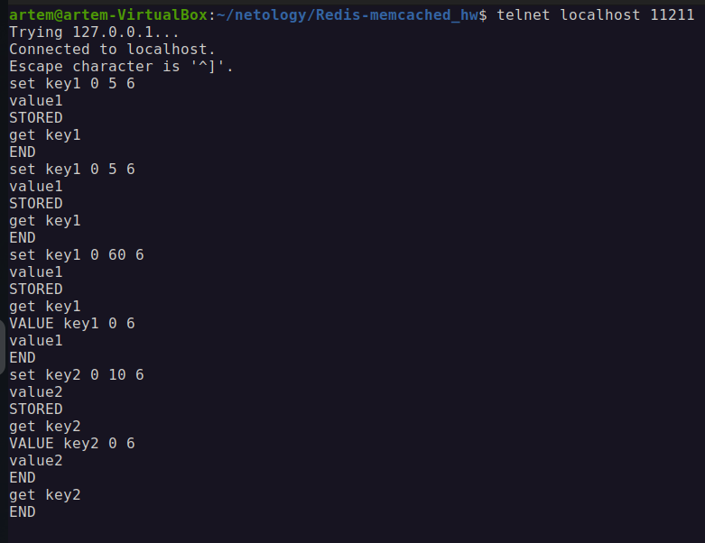
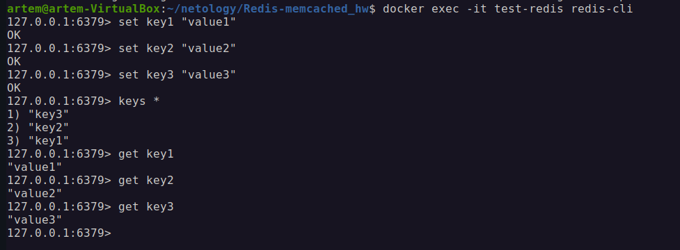

# Домашнее задание к занятию «Кеширование Redis/memcached»

### Задание 1. Кеширование 

Приведите примеры проблем, которые может решить кеширование. 

*Приведите ответ в свободной форме.*

### Решение:
1. Ускорение загрузки веб-страниц. Медленная загрузка страниц из-за частых запросов к базе данных или API.
Кеширование результатов запросов в Redis/Memcached позволяет быстро отдавать уже подготовленные данные.
2. Снижение нагрузки на базу данных. Высокая нагрузка на базу данных из-за большого количества однотипных запросов.
Запросы с неизменяющимися результатами можно кешировать и отдавать из памяти.
3. Снижение нагрузки на API и сторонние сервисы. Частые запросы к внешним API (например, курсы валют, прогноз погоды).
Кэширование результатов API-запросов позволяет не отправлять их каждый раз, а использовать сохранённые данные.
4. Улучшение производительности при вычислениях. Повторяющиеся сложные вычисления замедляют работу приложения.
Кэширование промежуточных результатов уменьшает время отклика.
5. Защита от DDoS и резких пиков нагрузки. Внезапный рост числа пользователей может перегрузить сервер.
Кэширование динамических страниц снижает нагрузку на сервер.
6. Оптимизация сессий пользователей. Частое обращение к базе данных для хранения данных о сессиях пользователей.
Кэширование сессий в Redis или Memcached ускоряет их обработку.
7. Обработка поисковых запросов. Долгое выполнение поисковых запросов.
Кэширование популярных результатов поиска снижает время ответа.

---

### Задание 2. Memcached

Установите и запустите memcached.

*Приведите скриншот systemctl status memcached, где будет видно, что memcached запущен.*

### Решение:
1. docker run -d --name memcached \
  -p 11211:11211 \
  memcached:latest
2. docker ps - проверка запущенного контейнера.
3. Подключение к memcached через telnet - telnet localhost 11211
4. status connect to telnet 

---

### Задание 3. Удаление по TTL в Memcached

Запишите в memcached несколько ключей с любыми именами и значениями, для которых выставлен TTL 5. 

*Приведите скриншот, на котором видно, что спустя 5 секунд ключи удалились из базы.*

### Решение:
1. С TTL 5 слишком быстро удаляется из кэша, не удалось протестировать. Для теста увеличил TTL

---

### Задание 4. Запись данных в Redis

Запишите в Redis несколько ключей с любыми именами и значениями. 

*Через redis-cli достаньте все записанные ключи и значения из базы, приведите скриншот этой операции.*

### Решение:
1. Установка Redis: docker run --name test-redis -d redis
2. Подключение через redis-cli: docker exec -it test-redis redis-cli
3. Задаем значения и достаем их:
